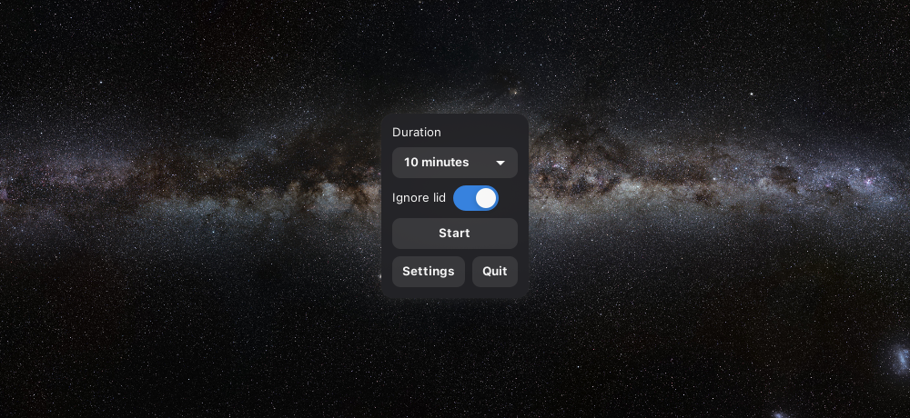

<div align="center">
  
  <h1>traypresso</h1>
</div>

Espresso in tray, for your laptop.

<div align="center">
  
</div>

A small Linux tray app that keeps your laptop awake for a chosen amount of
time, using `systemd-inhibit` under the hood.

## Features

- Lives in the system tray — no dock icon, no taskbar clutter
- Pick a duration from presets (10, 15, 30, 45 min, 1h, 2h, 3h) or run indefinitely
- Or type a custom duration (`12m`, `2.5h`, `90`)
- "Ignore lid" toggle — stay awake even with the laptop lid closed
- Remembers your last duration and lid setting between runs
- Press `Esc` or close the window to send it back to the tray; only Quit exits the app

## Installation

Requires Python 3, GTK 3 with PyGObject, an AppIndicator implementation, and
systemd (for `systemd-inhibit`).

**Debian/Ubuntu:**
```sh
sudo apt install python3-gi gir1.2-gtk-3.0 gir1.2-ayatanaappindicator3-0.1
```

**Fedora:**
```sh
sudo dnf install python3-gobject gtk3 libayatana-appindicator-gtk3
```

**Arch:**
```sh
sudo pacman -S python-gobject gtk3 libayatana-appindicator
```

Then clone and install:
```sh
git clone https://github.com/Floya-dev/traypresso.git
cd traypresso
./install.sh
```

`install.sh` adds traypresso to your application menu and sets it to start on
login. You can also skip installing and just run it directly:
```sh
python3 traypresso.py
```

## Usage

Open traypresso from your application menu (or the tray icon's "Open
traypresso" entry), pick a duration and whether to ignore the lid, then hit
**Start**. Hit **Stop** to end the session early. **Settings** lets you switch
to typing a custom duration instead of using the preset dropdown, and links
back to this repository.

## License

MIT — see [LICENSE](LICENSE).
